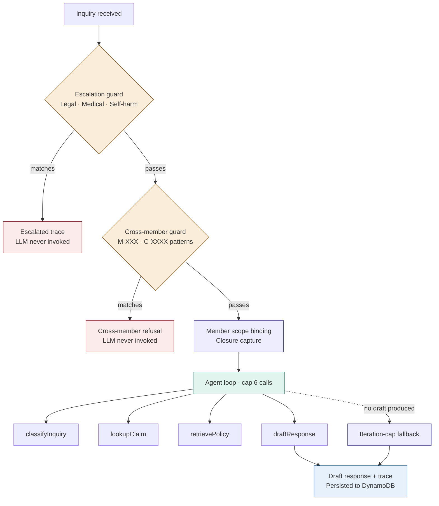

# Architecture

This document describes how the claims-agent system is put together: the request lifecycle, the components and their responsibilities, where architectural commitments live in code, and what isn't built. It's the structural reference. For *why* decisions were made, see [DESIGN_DECISIONS.md](./DESIGN_DECISIONS.md). For *what went wrong and how it got fixed*, see [LESSONS_LEARNED.md](./LESSONS_LEARNED.md). For operational setup, see [AWS_SETUP.md](./AWS_SETUP.md).

## 1. System overview

The claims-agent is an MVP agentic AI demo for synthetic health-insurance claim inquiries. A member-facing chat surface accepts natural-language questions ("Why was my claim denied?", "What's my deductible?"), and a four-tool ReAct agent produces a draft response grounded in synthetic policy documents and claim records. Two deterministic guards run before the agent loop catches high-stakes patterns (legal, medical, self-harm, cross-member queries) without invoking the LLM. Every classification, retrieval, and draft is logged to DynamoDB for human review.

The system is intentionally scoped to *demonstrate the architectural approach*, not to handle real PHI. All data is synthetic; the live demo at [claims-agent.rangbull-labs.com](https://claims-agent.rangbull-labs.com) carries a banner saying so on every page.

Three layered checks operate before the LLM is invoked. Each fails fast, runs in deterministic time, and contributes to the audit trail. The agent loop runs only for inquiries that pass all three.

## 2. Request lifecycle

A single inquiry — a `POST` to the Lambda Function URL with `{ memberId, inquiry }` — moves through seven steps. The orchestrator is [`runAgent` in `backend/src/agent.ts`](../backend/src/agent.ts).

**Step 1 — Escalation guard.** [`shouldEscalate(inquiry)`](../backend/src/safeguards/escalationGuard.ts) does pattern-based string matching against three categories: legal language ("sue", "lawyer", "lawsuit"), medical-advice triggers ("should I take", "is it safe to take"), and self-harm signals ("suicidal", "end my life", "kill myself"). On match, the orchestrator persists an `escalated` trace, returns immediately, and the LLM is never invoked. Latency: ~55-75ms. The guard fires deterministically; no model call, no cost.

**Step 2 — Cross-member guard.** [`detectCrossMemberReference(memberId, inquiry, lookupClaimOwner)`](../backend/src/safeguards/crossMemberGuard.ts) does two pattern checks. First: extract any `M-\d{3,}` references in the inquiry text; if any matched ID differs from the authenticated `memberId`, return `{ isViolation: true }`. Second: extract any `C-\d{4,}` references; for each, call `lookupClaimOwner(claimId)` (a deliberately cross-member DynamoDB read), and if the returned `memberId` differs from the authenticated user, return `{ isViolation: true }`. On violation, the orchestrator returns a `cross_member_refusal` draft response with `toolCallCount: 0` and `toolNames: ["crossMemberGuard"]`. Latency: ~60-70ms (one DynamoDB read for claim-ID cases, zero reads for member-ID-only cases).

**Step 3 — Member scope binding.** [`resolveMemberScope(memberId, modelId)`](../backend/src/middleware/memberScope.ts) fetches the authenticated member from DynamoDB and constructs the four tool factories with `memberId` captured in each closure. The tools accept no `memberId` argument and cannot be called against any other member. This is enforced at the JavaScript closure level, not as a runtime check — the agent has no way to express "look up another member's claims" because no parameter exists for it.

**Step 4 — Agent loop.** A [LangChain.js v1 `createAgent`](../backend/src/agent.ts) is built with the four tool factories, the system prompt (which includes grounding-discipline rules), and [`modelCallLimitMiddleware({ runLimit: 6 })`](../backend/src/agent.ts) as a defensive cap against runaway loops. The agent runs inside [`withTraceContext(traceId, memberId, ...)`](../backend/src/tracing/traceContext.ts) so every tool call accumulates on a trace context for persistence.

**Step 5 — Tool execution.** The agent calls tools in roughly this order: `classifyInquiry` → `lookupClaim` → `retrievePolicy` → `draftResponse`. Each tool's output is captured in the trace context. Tool details are in [Section 3](#3-component-map).

**Step 6 — Fallback check.** After the agent loop completes, the orchestrator checks whether a `draftResponse` tool call was actually made. Two failure modes can prevent this: (a) the model exhausts its 6-call budget without calling `draftResponse`, and (b) LangGraph throws a `GraphRecursionError` mid-loop (its internal limit of 25 graph nodes hits before the model-call cap). Both are caught: a `try/catch` wraps `agent.invoke()`, and the post-loop check sees a null draft response. The fallback substitutes `"I started looking into your question but wasn't able to complete the search. Please try rephrasing..."` with `intent: "iteration_cap_exceeded"` and logs a structured CloudWatch warning. Every successful request produces a draft response, even when the agent fails to converge.

**Step 7 — Persistence.** The full trace — including all tool inputs/outputs, the classification, the draft response, and the disposition — is written to the `claims-agent-AgentTraces` DynamoDB table via [`putTrace(trace)`](../backend/src/aws/dynamo.ts). The trace is queryable from the [`/traces` page](https://claims-agent.rangbull-labs.com/traces) on the frontend.

The HTTP response returns to the caller: `{ traceId, disposition, draftResponse, classification, toolCallCount, toolNames, durationMs, model }`.

## 3. Component map

| Component | Location | Responsibility |
|---|---|---|
| Escalation guard | `backend/src/safeguards/escalationGuard.ts` | Pattern-match three categories of high-stakes language before LLM invocation. Returns `{ escalate, reason }`. |
| Cross-member guard | `backend/src/safeguards/crossMemberGuard.ts` | Pattern-match member IDs and claim IDs in the inquiry; verify ownership via DynamoDB; refuse cross-member queries before LLM invocation. |
| Member scope middleware | `backend/src/middleware/memberScope.ts` | Fetch authenticated member, construct tool factories with `memberId` captured in closure. |
| Trace context | `backend/src/tracing/traceContext.ts` | AsyncLocalStorage-based context that accumulates tool-call logs across the agent loop. Cleanly isolated per request. |
| classifyInquiry tool | `backend/src/tools/classifyInquiry.ts` | Classify the user's inquiry into one of seven intents (`denial_explanation`, `eob_question`, `coverage_lookup`, `claim_status`, `cross_member_refusal`, `iteration_cap_exceeded`, `unknown`) with confidence. Uses `withStructuredOutput` against Bedrock. |
| lookupClaim tool | `backend/src/tools/lookupClaim.ts` | Member-scoped claim lookup. Accepts optional `claimId`, `dateFrom`, `dateTo`, `status` — but never `memberId`. Returns matching claims for the authenticated user only. |
| retrievePolicy tool | `backend/src/tools/retrievePolicy.ts` | RAG retrieval against the Bedrock Knowledge Base (Pinecone-backed). Returns relevant policy chunks with source URIs, filtered to the member's plan type. |
| draftResponse tool | `backend/src/tools/draftResponse.ts` | Persists the agent's final response with citations (claim IDs, policy chunk URIs) and confidence. Calling this signals the agent loop is complete. |
| Agent orchestrator | `backend/src/agent.ts` | The `runAgent` function. Sequences guards, member resolution, agent invocation, and persistence. |
| Lambda handler | `backend/src/index.ts` | HTTP routing: `POST /` → runAgent, `GET /members` → list members, `GET /traces` → list recent traces. CORS at the Function URL layer. |
| Eval suite | `backend/scripts/eval.ts` + `backend/eval/cases.json` | 30-case suite covering 5 categories, runs against deployed Lambda. Compares Haiku vs Sonnet on disposition match, intent match, and data isolation. Generates `docs/EVAL_REPORT.md`. |
| Integration tests | `backend/tests/integration/runIntegrationTests.ts` + `cases.json` | 4 happy-path and refusal cases that test the live Lambda end-to-end. Includes a `ConsistentRead` check against the persisted trace. |

## 4. Architectural commitments and where they live in code

Four commitments anchor the system. Each is verifiable in code, not just documented.

**Member scope isolation is enforced at the data layer via closure capture.** The four tool factories in `backend/src/tools/` all accept `memberId` as a constructor parameter and capture it in closure. The tools themselves (the functions exposed to the agent) accept no `memberId` argument — the type system rejects any attempt to pass one. This means the agent has no language for "look up another member's claims" because no such parameter exists on any tool. See [`memberScope.ts`](../backend/src/middleware/memberScope.ts) for the factory construction and [`lookupClaim.ts`](../backend/src/tools/lookupClaim.ts) for an example of how `memberId` is bound. The commitment is enforced by what the agent *can express*, not by what it *is told*.

**Cross-member queries are caught deterministically before LLM invocation.** [`detectCrossMemberReference`](../backend/src/safeguards/crossMemberGuard.ts) runs as step 2 of the orchestrator, before any model call. It catches two patterns: explicit member-ID references (`M-XXX` not matching the authenticated user) and claim-ID references whose owner doesn't match the authenticated user. On match, the agent loop is bypassed entirely; a `cross_member_refusal` draft is returned with `toolCallCount: 0`. This replaces what would otherwise be an LLM-mediated refusal (model-trusted) with a deterministic one (system-enforced). The guard catches explicit ID references; relational references ("my husband's claim") are a named gap — see [Section 7](#7-whats-not-built).

**Every request produces a draft response, even on convergence failure.** The agent's `modelCallLimitMiddleware({ runLimit: 6 })` caps how many model calls happen, but the model can exhaust its budget without calling `draftResponse`. Additionally, LangGraph has an internal `recursionLimit: 25` on graph traversal that can throw before the model-call cap fires. Both failure modes are handled in step 6 of [`agent.ts`](../backend/src/agent.ts): `agent.invoke()` is wrapped in `try/catch`, and after it returns (or throws), the orchestrator checks whether `draftResponse` was actually called. If not, a fallback response is substituted with `intent: "iteration_cap_exceeded"` and a structured CloudWatch warning is logged. This means every non-escalated, non-cross-member request returns a usable draft regardless of how the LLM behaves.

**Output is draft-only.** No tool sends a message, modifies a claim, or takes any external action. `draftResponse` writes to DynamoDB; the human reviewer (in this MVP, the `/traces` page) is the only path by which a draft becomes a real response. This commitment is structural — there is no "send" tool to begin with. Removing this commitment would require adding a new tool, not just removing a guard.

## 5. Data model

Three DynamoDB tables, all on-demand capacity, all prefixed `claims-agent-`.

**`claims-agent-Members`** — partition key `memberId` (e.g., `M-001`). Fields: `firstName`, `lastName`, `planType` (e.g., `PPO Silver`, `HMO Bronze`), `planEffectiveDate`, `dateOfBirth`. 16 synthetic members seeded via `pnpm seed-dynamo`. Read by the member-scope middleware on every request.

**`claims-agent-Claims`** — composite key `(memberId, claimId)`. Fields: `claimId` (e.g., `C-0007`), `dateOfService`, `providerName`, `serviceDescription`, `billedAmount`, `allowedAmount`, `memberResponsibility`, `status` (`paid` / `denied` / `pending`), `denialCode` (optional), `denialReason` (optional). 40 synthetic claims distributed across members. The composite key matters: `getItem` requires both partition and sort key (see [LESSONS_LEARNED §6](./LESSONS_LEARNED.md#dynamodb-get-item-requires-both-partition-and-sort-key)). The cross-member guard uses a `Scan` with filter on `claimId` to find the owner of a referenced claim.

**`claims-agent-AgentTraces`** — partition key `traceId` (e.g., `tr-<uuid>`). Fields: `timestamp`, `memberId`, `userInquiry`, `classification` (intent + confidence + reasoning), `toolCalls` (array of `{toolName, input, output, durationMs, timestamp}`), `draftResponse`, `disposition` (`draft` / `escalated`), `model`, `escalationReason` (optional). One trace per request. Persisted before the HTTP response returns. Queryable from the `/traces` page (returns the 50 most recent).

The trace shape is the system's audit artifact. Every classification, retrieval, and draft is captured. The `/traces` page is the human-review surface; in production, this would be an internal CSR workstation, not a public route.

## 6. Failure modes and safeguards

The system handles five distinct failure modes, each at a different layer.

**High-stakes language (legal, medical, self-harm).** Caught by the escalation guard at step 1. LLM is never invoked. Latency ~55-75ms. The guard uses string matching, not semantic understanding — phrasings outside the pattern list will pass through to the agent loop. This is a named gap; an LLM-based classifier could catch more variations but reintroduces model dependency at this layer.

**Cross-member queries.** Caught by the cross-member guard at step 2. Catches explicit member-ID and claim-ID references where ownership doesn't match the authenticated user. Latency ~60-70ms. Relational references (e.g., "my husband's claim") are not caught and would proceed to the agent loop; in the current demo, the data-layer commitment still prevents data leakage even if the model attempts the lookup, but the refusal behavior is not deterministic for these phrasings.

**Grounding fidelity (LLM hallucination from policy text).** The grounding-discipline section in the agent's system prompt requires the agent to verify that every assertion in the draft is backed by data the tools actually returned. This is model-trusted, not deterministic — the system relies on the LLM following the instructions. The integration test `empty-result-no-denied-claims` exercises a regression case (M-001 asked about denied claims when the member has none) and has been stable since the system prompt was tightened. See [LESSONS_LEARNED §5](./LESSONS_LEARNED.md#5-agent-behavior-surprises) for the original failure and the fix.

**Agent loop convergence failure.** Two distinct sub-modes: (a) the agent completes its 6 model calls without invoking `draftResponse`, returning a null draft; (b) LangGraph throws a `GraphRecursionError` when its internal graph-node limit (25) is hit before the model-call cap. Both are caught by the iteration-cap fallback in step 6. The agent's `invoke()` call is wrapped in `try/catch`, and the post-loop check substitutes a fallback response when no `draftResponse` was made. Logged to CloudWatch as a structured warning so the rate is observable.

**Classifier degradation.** The `classifyInquiry` tool uses `withStructuredOutput`, which is not 100% reliable on Bedrock-hosted Claude models. On parse failure, the tool returns `{intent: "unknown", confidence: 0, reasoning: "Classifier error: ..."}` rather than throwing. The orchestrator continues with `intent: "unknown"`; the agent has enough context to draft a reasonable response. The rate is currently bounded — the eval suite saw `unknown` classifications only on genuinely ambiguous edge cases. If the rate exceeds ~5% on well-formed inputs, the fallback strategy would be prompt-engineered JSON output with manual parsing instead of `withStructuredOutput`.

## 7. What's not built

Several capabilities are intentionally not in scope for this MVP. Naming them explicitly here avoids confusion about what the demo is and isn't trying to be.

**Real PHI handling.** All data is synthetic. The system is "HIPAA-shaped" — built with the architectural commitments that would be needed for HIPAA-compliant systems — but it is not a HIPAA-compliant system. No BAA, no encryption-at-rest configuration tuning, no PHI-specific access logging. Production deployment would require all of these.

**Relational cross-member detection.** The cross-member guard catches explicit ID references (`M-015`, `C-0007`) but not natural-language relational references ("my husband's claim", "my dependent's recent visit"). Catching these requires semantic detection — likely an LLM classifier with a `cross_member_refusal` intent — which would reintroduce model dependency at the guard layer. In the claims-inquiry domain, relational references are rare enough that the explicit-ID guard covers the eval-surfaced failure modes. A production deployment in a domain with frequent dependent/spouse references would need a different approach.

**Autonomous send action.** No tool sends a draft to the member. The system writes drafts to DynamoDB; the `/traces` page is the human-review surface. Promoting a draft to a sent response would require building both the send action and the human-approval gate, which are explicit deferred items in [DESIGN_DECISIONS.md Section 5](./DESIGN_DECISIONS.md#5-four-safeguard-layers--and-which-two-are-shipped).

**Deterministic policy engine.** The grounding-discipline rule is enforced via system prompt, not by a deterministic policy lookup. A production-grade system would have a deterministic policy decision layer between `retrievePolicy` and `draftResponse` — given the policy chunks retrieved and the member's plan, this layer would precompute "is X covered, yes/no" and the model would only narrate, not decide.

**Confidence-based promotion gates.** The eval suite captures confidence per inquiry, but there's no production gate that routes low-confidence drafts to human review and high-confidence drafts to auto-send. The whole system is in "draft" disposition; the gate is implicit (a human reviewer reads every trace). A production version would have explicit confidence bands and gating thresholds.

**Real monitoring.** CloudWatch logs everything the Lambda emits, and the eval suite can be re-run to surface regressions. But there's no dashboard, no alerting, no SLO. A `iteration_cap_exceeded` rate alert and a per-category accuracy regression alert would be the first two to add.

**Multi-language support.** All inquiries assumed to be English. The agent's classifier hasn't been tested on other languages.

## 8. Operational concerns

The system runs on AWS in `us-east-1`, with Bedrock inference profiles routing across the US region cluster (`us-east-1`, `us-east-2`, `us-west-2`).

**Lambda configuration.** Node.js 24.x runtime, 512MB memory, 60s timeout, x86_64 architecture. Reserved concurrency capped at 2 for cost control during the demo. Function URL with CORS headers handled at the function-URL layer (not API Gateway). Lambda execution role has `bedrock:InvokeModel` on the inference profile ARNs plus the foundation model ARNs in all three US regions (see [LESSONS_LEARNED §1](./LESSONS_LEARNED.md#bedrock-inference-profile--cross-region-foundation-model-arns) for why all three).

**Cost controls.** Reserved concurrency cap of 2 limits parallel Lambda invocations. CloudWatch billing alarm at $20 alerts via email if monthly Bedrock + Lambda + DynamoDB charges approach the limit. Frontend rate-limited via Cloudflare Free Plan (1 request per 10 seconds per IP, 10-second block on exceed) to prevent accidental cost spikes from the public demo. Cost per inquiry: ~$0.025 with Haiku, ~$0.105 with Sonnet (per [EVAL_REPORT.md](./EVAL_REPORT.md)).

**IAM posture.** The development user `claims-agent-dev` follows least-privilege: only the actions actually needed for build, deploy, and operate the system. The policy is documented in [AWS_SETUP.md Section 3.1](./AWS_SETUP.md#31-create-the-iam-user). The Lambda execution role is a separate, smaller policy scoped to runtime operations only. See [LESSONS_LEARNED §1](./LESSONS_LEARNED.md#1-iam-and-least-privilege-gotchas) for the gotchas hit during build.

**Observability.** CloudWatch Logs capture every Lambda invocation, including the structured warnings emitted by the iteration-cap fallback and the cross-member guard. The `/traces` page on the frontend serves as the audit-review surface for individual requests. There is no centralized monitoring beyond CloudWatch's default offerings.

**Deploy.** `bash backend/deploy.sh` bundles the Lambda code (esbuild via JS API, see [LESSONS_LEARNED §4](./LESSONS_LEARNED.md#4-langchainjs-ecosystem)) and uploads to AWS Lambda via `update-function-code`. Frontend deploys via `firebase deploy --only hosting:claims-agent-demo`. Both are manual; CI/CD is not configured for this project.

**Data lifecycle.** Synthetic data is seeded via `pnpm seed-dynamo`. The knowledge base is ingested via `pnpm ingest-kb` (uploads synthetic policy documents to S3, then triggers a Bedrock `StartIngestionJob` against the Pinecone-backed KB). There is no scheduled re-ingest; if policy documents change, the script is re-run manually.

---

For further reading:
- **[DESIGN_DECISIONS.md](./DESIGN_DECISIONS.md)** — why each architectural commitment was made, mapped to the MIT Sloan Implementing Agentic AI framework
- **[LESSONS_LEARNED.md](./LESSONS_LEARNED.md)** — friction points encountered during build and how each was diagnosed and fixed
- **[EVAL_REPORT.md](./EVAL_REPORT.md)** — empirical comparison of Haiku 4.5 vs Sonnet 4.5 across 30 cases × 5 categories
- **[AWS_SETUP.md](./AWS_SETUP.md)** — operational setup, IAM policy details, KB creation, Lambda configuration